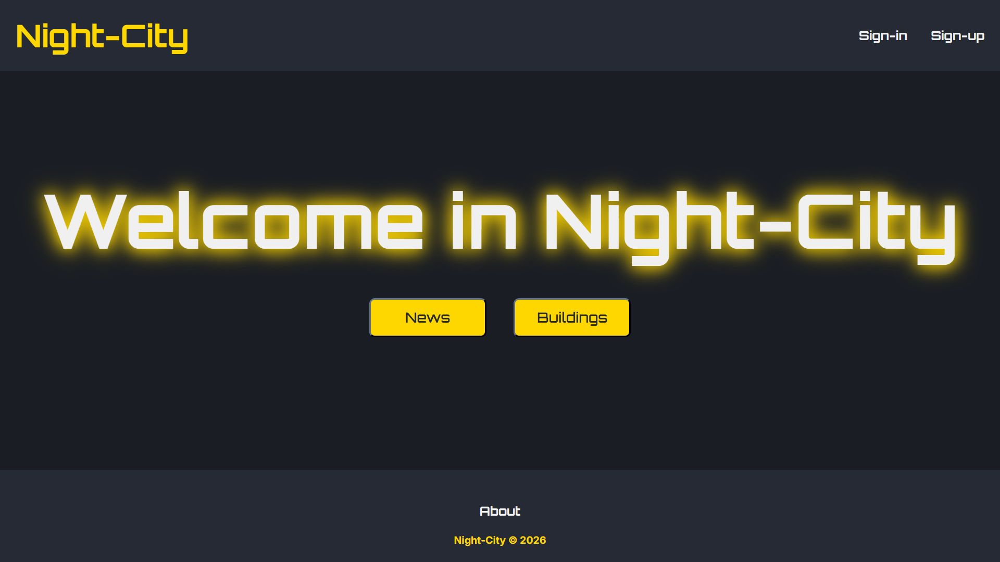

<h1 align="center">🔋 Night City 🔋</h1>
 

 
## Introduction
 
**Night City** is a web application project built in React, Express (Node) and MongoDB with Docker containerisation and nginx as a reverse proxy, that simulates an intelligent city where users can create and manage buildings as well as the smart IoT devices that are inside.
 
Users can see the different smart buildings of the city and their descriptions, join them with a secret code or even create their own. Then they can create the different devices that will be shared and used by the people there. They can even publish some news related to the building in order to inform the others about what is happening.
 
## Prerequisites
 
- Docker and Docker Compose
## Installation
 
1. **Install Docker if not yet installed (Ubuntu) :**
```sh
# Prerequisites
sudo apt update
sudo apt install -y ca-certificates curl
 
# Docker's GPG key
sudo install -m 0755 -d /etc/apt/keyrings
sudo curl -fsSL https://download.docker.com/linux/ubuntu/gpg -o /etc/apt/keyrings/docker.asc
sudo chmod a+r /etc/apt/keyrings/docker.asc
 
# Repository
echo \
  "deb [arch=$(dpkg --print-architecture) signed-by=/etc/apt/keyrings/docker.asc] \
  https://download.docker.com/linux/ubuntu $(. /etc/os-release && echo "$VERSION_CODENAME") stable" | \
  sudo tee /etc/apt/sources.list.d/docker.list > /dev/null
 
# Install
sudo apt update
sudo apt install -y docker-ce docker-ce-cli containerd.io docker-buildx-plugin docker-compose-plugin
```
 
For Debian, replace `ubuntu` with `debian` in the two URLs above. For Windows and macOS, install [Docker Desktop](https://www.docker.com/products/docker-desktop/).
 
2. **Clone the repository :**
```sh
git clone https://github.com/RayyyZen/Night-City.git
```
 
3. **Move into the project folder :**
```sh
cd Night-City
```
 
4. **Launch the application :**
```sh
sudo docker compose up -d --build
```
 
5. It is running on port 8080 so you can access the application by typing in your browser the following url
```sh
http://localhost:8080/
```
 
## Informations about the app launch
 
There is a `.env.example` file that includes a template of the variables that can be changed. Copy it to `.env` at the root of the project to use it :
- **WEB_PORT** : the port on which the application runs, so you can change it if needed (for example if 8080 is already in use)
- **SESSION_SECRET** : the secret that signs the session cookie in order to avoid it being changed and corrupted (it can also be changed to an unknown one)
- **API_KEY_RESEND** : if you have a Resend API key you can put it there, then you will be able to receive mails with the verification codes when you try to login or register (keep in mind that if you don't provide an API key, all the verification codes will be 000000)
## Docker and Nginx
 
There are 2 Dockerfiles, in the `client/` and `server/` folders. They are used to generate the images of respectively the frontend and the backend, in order to build the containers of each one with the Docker Compose file. The client's Dockerfile uses a multi-stage build : the first stage builds the React application with Vite, and the second one only keeps the generated static files inside an nginx image. The nginx configuration serves those static files and redirects the `/api` traffic to the server service, that way there is no CORS to worry about because both the front and the back come from the same origin. There is also a MongoDB container that stores the data in a volume, as well as a second volume for the uploaded images (profile pictures).
 
## Project Overview
 
### User
 
Users can create their accounts according to their informations in order to be able to join or create a building. When a user is created there is a verification code that is sent to the email (if there is an API_KEY_RESEND key, otherwise the verification code is always 000000) to be sure that the right email is given. When a user is logged in, he can check his profile (with his profile picture) and change some informations such as his name. He can also start searching for a building to join or create his own one. When the user belongs to a building there is a level system (beginner, intermediate, expert) and he begins as a beginner. As long as he is active in the building by using the devices, he gains some points that can promote him. A beginner can only see the building infos, use devices and see the other users that belong to the building ; an intermediate one can, in addition to that, publish news related to the building that can be viewed by others ; and an expert can create his own devices. Only the owner can change the building infos, kick users and change their roles in the building.
 
An admin user has a page that shows the list of all the users that have an account, and can delete their accounts.
 
### Building
 
These are the buildings that are created by the users. When created they have a unique name, an address, a surface and a description that can be changed by the owner (some fields). There is also a password that is then needed by anyone who wants to join the building ; the password can also be changed. The owner has full control of the users, so he can kick any user and change their roles among the building. There is a page that displays all the created buildings, and keep in mind that you can belong to only one building at once. If the owner leaves the building, a random owner is designated from the other users of the building. And if no one belongs to the building anymore, it is deleted instantly.
 
### Device
 
Each building has many smart devices that can be used, canceled, created or even go to maintenance. Only the owner and the expert users of the building can make maintenance to a device, and only the creator of the device and the owner can change its details such as its energy consumption.
 
### News
 
Each user that belongs to a building can publish news related to the building, which are showcased in a page with the latest news. Only an owner or a user of at least intermediate level can publish news.
 
## NB
 
To have access to the admin interface, there is an account already created with the following credentials : 
- email : `admin@demo.com`
- password : `demo`
 
All the verification codes are `000000` if no Resend API key is provided.
 
## License
 
This project is licensed under the BSD 2-Clause License. See the [LICENSE](LICENSE) file for details.